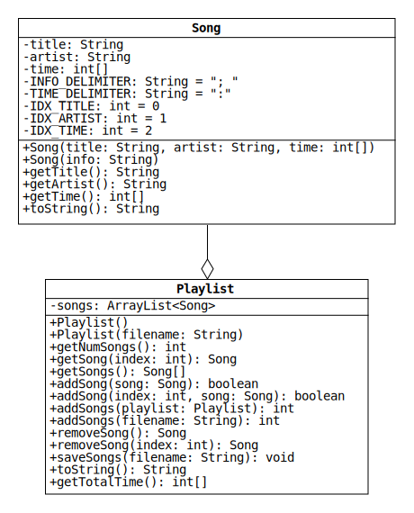

# Lab 5: Reading and Writing Playlists

In Lab 4, we wrote classes that represent playlists of songs.
Those classes have two notable limitations:

1. Playlists have a fixed capacity.
Once a Playlist is full, there is no way to add more Songs without making a new Playlist.
2. Playlists are lost when the program that is using them stops.
There is no way to save the content of a Playlist and load it in the future.

In this lab, we will modify Song and Playlist to overcome these limitations.
The UML diagram for the updated classes is shown below.



The starter code in your repo includes most of the methods from Lab 4.
The Song starter code, for instance, will pass all of the Lab 4 unit tests.

## Song Class

Song has been expanded with a second constructor and a toString method.
The constructor initializes Song objects by parsing information stored in Strings.
The toString method returns String representations of Songs in the format parsed by the constructor.

* `Song(String info)`: Initialize a Song by parsing a String that contains the title, artist, and time with a semicolon and a space used as the [delimiter](https://en.wikipedia.org/wiki/Delimiter).
For example, the info String for the song "Where the Streets Have No Name" by U2 is

  ```java
  "Where the Streets Have No Name; U2; 5:36"
  ```

  The time is given as a number of hours, minutes, and seconds separated by colons.
  The minutes and seconds are numbers between 0 and 59.
  If the song is less than an hour, only the minutes and seconds are given.
  Similarly, if the song is less than a minute, only the seconds are given.

* `toString()`: Return a String representation of the Song in the same format as the info Strings parsed by the new constructor.
For example, suppose a Song is instantiated with the following code:

  ```java
  Song song = new Song("Where the Streets Have No Name", "U2", new int[] {36, 5});
  ```

  Calling `song.toString()` returns the info String shown above.

  If the song is longer than a minute, pad the number of seconds with a leading 0 if it is less than 10.
  Similarly, if the song is longer than an hour, ensure that the number of minutes also has two digits.

### Song Hints

* Break an info String into pieces using the [String class split method](https://docs.oracle.com/en/java/javase/11/docs/api/java.base/java/lang/String.html#split(java.lang.String)).
* Remove [magic numbers](https://en.wikipedia.org/wiki/Magic_number_(programming)#Unnamed_numerical_constants) from your code by replacing them with the static constants shown in the UML diagram.
For instance, pass `INFO_DELIMITER` to the split method, rather than `"; "`.
This will make your code more readable.
* A String of digits can be converted to an int with the [Integer class parseInt method](https://docs.oracle.com/en/java/javase/11/docs/api/java.base/java/lang/Integer.html#parseInt(java.lang.String)).
* The easiest way to pad an int with zeros is to use the [String class format method](https://docs.oracle.com/en/java/javase/11/docs/api/java.base/java/lang/String.html#format(java.lang.String,java.lang.Object...)).
Pass the method the format String `"%02d"`, which indicates that the int should be formatted as a String of at least two digits.

## Playlist Class

Playlist has been [refactored](https://en.wikipedia.org/wiki/Code_refactoring) to use an [ArrayList](https://docs.oracle.com/en/java/javase/11/docs/api/java.base/java/util/ArrayList.html), which allows it to encapsulate an arbitrary number of Songs.
The starter code includes updated versions of most of the methods from Lab 4, but you need to update the methods described below.

* `Playlist()`: Initialize an empty Playlist.

* `addSong(int index, Song song)`: Add the given Song to the Playlist at the given index.
If the Song reference is null or the index is out of bounds (less than 0 or greater than the index of the last Song plus 1), leave the Playlist unchanged.
If the Song is added, return true; otherwise, return false.

* `addSongs(Playlist playlist)`: Add the given Songs to the end of the Playlist in the given order.
Return the number of added Songs.
If the Playlist reference is null, return 0.

* `removeSong(int index)`: Remove and return the Song with the given index.
If the index is out of bounds (less than 0 or greater than the index of the last Song), return null.

Playlist has been expanded with methods that read and write song information to text files.
A method has also been added that returns the total time.

* `Playlist(String filename)`: Initialize a Playlist by parsing a text file of info Strings with the given name.
The resulting Playlist contains a Song for each line of the file, and the Song order matches the order of the info Strings.

* `addSongs(String filename)`: Read a file of info Strings with the given name.
For each line of the file, create a Song and add it to the end of the Playlist.

* `toString()`: Return the String representations of the Songs joined by line separators.
For example, suppose a Playlist contains the songs "Resistance" and "Madness" by Muse.
Calling toString returns

  ```java
  "Resistance; Muse; 5:46" + System.lineSeparator() + "Madness; Muse; 4:39"
  ```

  The [lineSeparator method](https://docs.oracle.com/en/java/javase/11/docs/api/java.base/java/lang/System.html#lineSeparator()) returns the correct [newline character sequence](https://en.wikipedia.org/wiki/Newline) for your operating system (`"\r\n"` for Windows and `"\n"` for macOS and Linux).

* `saveSongs(String filename)`: Save the output of toString to a file with the given name.
Overwrite the contents of the file if it already exists.

* `getTotalTime()`: Return the total time of all the Songs as an array of integers.
Use the same format as the time field in the Song class.

### Playlist Hints

* The new constructor can be implemented in just two lines.
First, [use `this` to call the other constructor](https://docs.oracle.com/javase/tutorial/java/javaOO/thiskey.html).
Next, call addSongs to read the file.
* Implement addSongs by reading each line of the file and passing it to the new Song constructor.
* Use a [StringJoiner](https://docs.oracle.com/en/java/javase/11/docs/api/java.base/java/util/StringJoiner.html) to implement toString.
* Implement getTotalTime in two steps:
  1. Calculate the total number of seconds, minutes, and hours.
  2. Use integer division and modular arithmetic to convert the excess seconds to minutes and the excess minutes to hours.

## Reading and Writing Files

In your first programming course, you may have used the Scanner and PrintWriter classes to read and write files.
You're welcome to use those classes here, but it's worth learning to use [BufferedReader](https://docs.oracle.com/en/java/javase/11/docs/api/java.base/java/io/BufferedReader.html) and [BufferedWriter](https://docs.oracle.com/en/java/javase/11/docs/api/java.base/java/io/BufferedWriter.html) as well.
Objects of these classes can be created with the following statements:

```java
BufferedReader br = new BufferedReader(new FileReader(filename));
BufferedWriter bw = new BufferedWriter(new FileWriter(filename));
```

Call [readLine](https://docs.oracle.com/en/java/javase/11/docs/api/java.base/java/io/BufferedReader.html#readLine()) on a BufferedReader to read the next line of a text file.
The method returns null after it reads the last line.
Call [write](https://docs.oracle.com/en/java/javase/11/docs/api/java.base/java/io/Writer.html#write(java.lang.String)) on a BufferedWriter to write a given String to a text file.
After you are done reading or writing, call [close](https://docs.oracle.com/en/java/javase/11/docs/api/java.base/java/io/Writer.html#close()).

Any method that uses a BufferedReader or BufferedWriter must be able to throw an [input-output exception](https://docs.oracle.com/en/java/javase/11/docs/api/java.base/java/io/IOException.html).
To do this, import `java.io.IOException` and add `"throws IOException"` after the method's parameter list.
(For an example, see the helper method checkFile at the end of the PlaylistTest class.)
We'll learn much more about exceptions later in the semester.

## Special Topic: Javadoc

[Javadoc](https://en.wikipedia.org/wiki/Javadoc) is a widely-used tool for generating HTML documentation files from Java code.
Read our [Javadoc tutorial](Javadoc.md) and follow the instructions to document the Song and Playlist classes.
For additional help writing Javadoc comments, see sections 6.20 and 7.18 of the zyBook.
