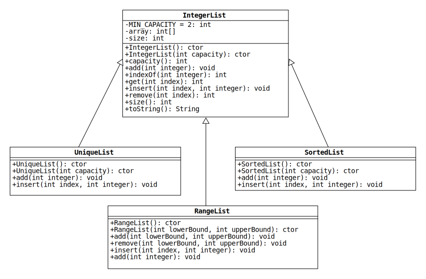

# Lab 6: Inheritance with Lists

In object-oriented programming, inheritance allows an existing class to be "extended" to create specialized subclasses.
We call each subclass a "derived" or "child" class and the existing class the "parent" class.

In this lab, you are given starter code for the parent class **IntegerList**.
Your goal is to complete this class and then implement three subclasses: **UniqueList**, **SortedList**, and **RangeList**.
Each subclass modifies the behavior of IntegerList in a different way.

## Class Diagram

Inheritance is represented in UML diagrams by an arrow that connects two classes.
The arrow points from the child class to the parent class.
The following is a UML diagram for IntegerList and its child classes:



Notice that each child class has some methods with the same signature and return type as IntegerList.
This indicates that the child classes [override](https://docs.oracle.com/javase/tutorial/java/IandI/override.html) these parent class methods.


## IntegerList Class

This class is a [dynamic array](https://en.wikipedia.org/wiki/Dynamic_array) of integers.
Its behavior is very similar to `ArrayList<Integer>`.
All of the methods have been written for you except those listed below.
See the Javadoc comments for more information.

* `IntegerList(int)`
* `indexOf(int)`
* `get(int)`
* `toString()`

## UniqueList Class

This subclass does not allow duplicate integers to be added to the list.

* `UniqueList()`: Call the parent constructor to create an empty list with an initial capacity of MIN_CAPACITY.

* `UniqueList(int)`: Call the parent constructor to create an empty list with the given capacity.

* `add(int)`: Check whether the given integer is already in the list before appending it.
If so, throw an IllegalArgumentException with the message shown in the unit tests.

* `insert(int, int)`: Check whether the given integer is already in the list before inserting it.
If so, throw an IllegalArgumentException with the message shown in the unit tests.

## SortedList Class

This subclass adds integers to the list in ascending sorted order.

* `SortedList()`: Call the parent constructor to create an empty list with an initial capacity of MIN_CAPACITY.

* `SortedList(int)`: Call the parent constructor to create an empty list with the given capacity.

* `add(int)`: Insert the integer in the list at the position that maintains the sorted order.

* `insert(int, int)`: Throw an UnsupportedOperationException to disable this method.
That way, users of the class cannot insert integers at arbitrary positions in the list.

## RangeList Class

This subclass adds ranges of integers to list. These ranges are defined by a lower bound and an upper bound (both inclusive).

* `RangeList()`: Call the parent constructor to create an empty list with an initial capacity of MIN_CAPACITY.

* `RangeList(int, int)`: Call the parent constructor to create an empty list with an initial capacity of MIN_CAPACITY. If the `lowerBound` is greater than `upperBound`, 
it throws an `IllegalArgumentException` with this message:
   ```java
   "The upper bound must be greater than or equal to the lower bound."
   ```
   If no exceptions are thrown, it inserts all integers in the range `[lowerBound, upperBound]` inclusive.

* `add(int, int)`: Throws an `IllegalArgumentException` if `lowerBound` is greater than `upperBound` with the message mentioned earlier. If the list is empty, it adds the specified range of integers. Otherwise, it checks both `lowerBound` and `upperBound` separately.
If `lowerBound` is less than the current lower bound in the list, it extends the list to the left. If `upperBound` is greater than the current upper bound in the list, it extends the list to the right. For example: If the current list contains `[ 4, 5, 6, 7]` , a call of `add(0, 6)` should result in the following list: `[0, 1, 2, 3, 4, 5, 6, 7]`. Likewise, a call of `add(5, 9)` to the same initial list should result in the following: `[4, 5, 6, 7, 8, 9]`. A call of `add(0, 9)` should change the list as follows: `[0, 1, 2, 3, 4, 5, 6, 7, 8, 9]`.

* `remove(int, int)`: Throw `IllegalArgumentException` if the `lowerBound` is greater than the `upperBound` with the same message similar to the previous methods. If the list is empty, it throws `UnsupportedOperationException` with the following message: `"Cannot remove range from an empty list."`. If the range is outside the current range of the list, throw an `IllegalArgumentException` with the message: `"Lower and/or upper bounds are out of the current list range."`. An example of this situation is trying to `remove(7,10)` from a `RangeList [0,5]`. If the range is non-terminal, throw an `IllegalArgumentException` with the following message: `"Cannot remove non-terminal ranges."`. A terminal range is a range that starts at the first element of the list or/and ends at the last element of the list. For example, trying to `remove(3,7)` from a `RangeList [1, 10]` is an attempt to remove a non-terminal range since neither the start of this range (3) nor the end of it (7) are the start or the end of the current range (1 or 10). If none of the above exceptions are thrown, use the parent's method `remove(int)` to remove the specified range from the list.

* `insert(int, int)`: Throw an `UnsupportedOperationException` to disable this method.

* `add(int)`: Throw an `UnsupportedOperationException` to disable this method.


