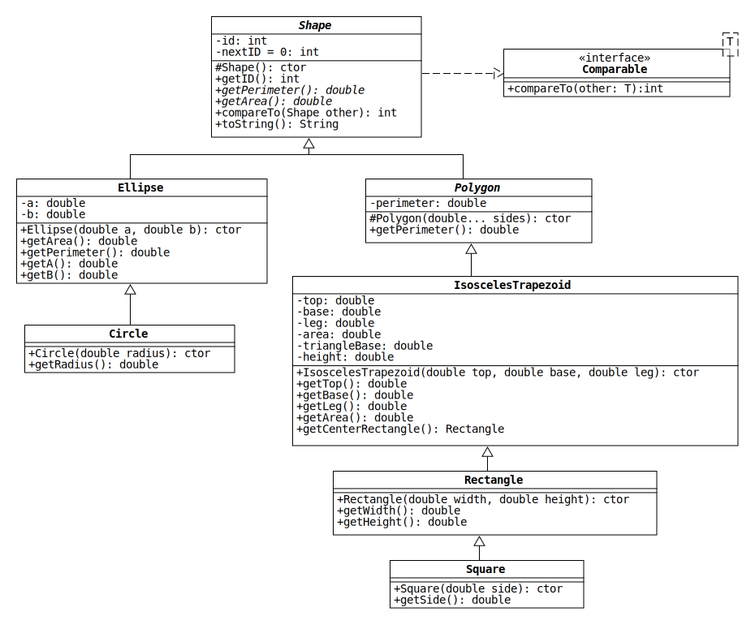
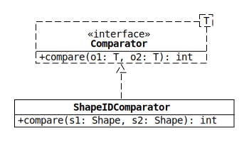

# Lab 8: A Hierarchy of Immutable Shapes

Every object-oriented programming course that covers inheritance seems to have an assignment with a hierarchy of shape classes.
The popularity of the topic can probably be explained by two facts:

1. Everyone is familiar with two-dimensional geometric shapes (e.g., circles, triangles, squares), so they're easy to talk about.
2. Many shapes can be defined as a special type of a more general shape (e.g., squares are rectangles with equal-length sides), and inheritance is designed to model this kind of relationship.[1](#f1)

In this lab, we will continue the trend by implementing the hierarchy of shape classes shown in the following UML diagram:

The diagram has two symbols that haven't appeared in earlier assignments:

1. An arrow with a dashed line indicates that a class implements an interface.
2. A dashed box in the upper-right corner of an interface (or class) indicates a generic type.

If you need to review interfaces or generic classes, see sections 11.4 and 14.3 of the zyBook.

## Shape

The top class in the hierarchy represents any two-dimensional geometric shape.
It contains abstract methods that any concrete subclass must override to return the [perimeter](https://en.wikipedia.org/wiki/Perimeter) and [area](https://en.wikipedia.org/wiki/Area).

* `Shape()`: Assign the current value of the static field nextID to the instance field id and then increment nextID.
This ensures that every Shape object has a unique ID number.

* `compareTo(Shape other)`: Shape implements the [Comparable interface](https://docs.oracle.com/en/java/javase/11/docs/api/java.base/java/lang/Comparable.html), which requires it to override the compareTo method.
See the API documentation or section 14.1 of the zyBook for information on how this method works.

  Write compareTo so that a collection of Shapes will be sorted first by type, then by perimeter, and then by area.
  The Shape with the smaller value should appear first.
  For instance, if two Shapes are both Rectangles, the one with the smaller perimeter appears first.
  If the perimeters are equal, the one with the smaller area appears first.

  To get the type (i.e., class name) of an object, call `getClass().getName()` on its reference.
  For an example, see the toString method in the starter code.

## Ellipse 

* `Ellipse(double a, double b)`: Assign the given values of `a` (semi-major axis length) and `b` (semi-minor axis length). Before doing this, the values of `a` and `b` must be validated as follows: 
If any of the values is less than or equal to zero, throw an IllegalArgumentExcepion with the message `"Nonpositive value(s) provided for the constructor"`. If the semi-major axis length is less than the semi-minor axis length, throw an IllegalArgumentException with the message `"Semi-major axis length cannot be less than semi-minor axis length"`

* `getArea()`: Returns the area of the ellipse. 

* `getPerimeter()`: Returns an approximation of the perimeter of the Ellipse. Please use the formula described in [this article](https://www.mathsisfun.com/geometry/ellipse.html) to approximately calculate the perimeter of the Ellipse. 

* `getA()`: Returns the value of the variable `a`, which is the length of the semi-major axis of the ellipse.

* `getB()`: Returns the value of the variable `b`, which is the length of the semi-minor axis of the ellipse.

## Circle

* `Circle(double radius)`: Calls the parent constructor to create a circle of the specified radius. Note that a circle is a special case of the ellipse, where both `a` and `b` are equal. 

* `getRadius()`: Returns the radius of the circle.
Do not use any additional data members for the `Circle` class.

## Polygon

The abstract Polygon class represents any closed, two-dimensional shape that consists of three or more straight line segments.

* `Polygon(double... sides)`: Check whether the given values can be the side lengths of a polygon and calculate the perimeter.
Throw an IllegalArgumentException if any of the following conditions is true:

  1. If the array reference is null, throw an exception with the message `"null sides"`.

  2. If the number of sides is less than 3, use the message `"Invalid number of sides: <sides.length>"`.

  3. If any side length is not positive, use the message `"Nonpositive side: <side>"`.

  4. If any side length is greater than or equal to the sum of the lengths of the other sides, use the message `"Polygon inequality violated: <side> >= <sum>"`.
  (The [polygon inequality](https://en.wikipedia.org/wiki/Triangle_inequality#Generalization_to_any_polygon) is a generalization of the triangle inequality.)

## IsoscelesTrapezoid

This class represents any trapezoid where the non-parallel sides have the same length (i.e., an [isosceles trapezoid](https://en.wikipedia.org/wiki/Isosceles_trapezoid)).
Below are a couple of examples.

The sides labeled *a*, *b*, and *c* are called the "top," "base," and "legs" of the trapezoid, respectively.

Notice that an isosceles trapezoid can be split into a rectangle and two right triangles with the same dimensions.
We will call these component shapes the "center rectangle" and "side triangles" of the trapezoid.

* `IsoscelesTrapezoid(double top, double base, double leg)`: Pass the given values to the parent constructor to check whether they are valid side lengths for a trapezoid.
(Note: The parent constructor should be given four values, since a trapezoid has four sides.)

* `getCenterRectangle()`: Return a Rectangle object with the dimensions of the center rectangle.

## Rectangle

* `Rectangle(double width, double height)`: Pass the given values to the parent constructor so that the width is assigned to the top and base and the height is assigned to the leg.

## ShapeIDComparator

Comparator objects can be used by methods like those in the [Collections class](https://docs.oracle.com/en/java/javase/11/docs/api/java.base/java/util/Collections.html) to define alternative orderings for collections.
For instance, the sort method has two versions: one that takes only a List and one that takes a List and a Comparator.
The first method sorts objects in the List using their compareTo method, which defines the default ordering.
The second method sorts objects using the compare method of the given Comparator.

Write a comparator class named "ShapeIDComparator" that sorts Shapes by their ID number in ascending order.
To do this, implement the [Comparator interface](https://docs.oracle.com/en/java/javase/11/docs/api/java.base/java/util/Comparator.html) as shown in the following diagram:

## Footnotes

<a id="f1">[1.](#a1)</a> Ironically, there is a [famous problem](https://en.wikipedia.org/wiki/Circle%E2%80%93ellipse_problem) that uses shape classes to illustrate the shortcomings of inheritance.
However, the problem only applies to mutable objects, and all of the classes in this assignment are immutable.
