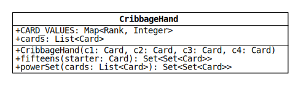
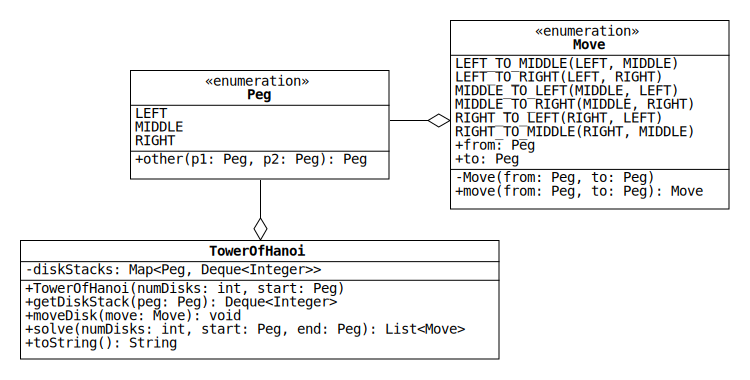

# Lab 10: A Set of Recursive Algorithms

In this lab, we will implement three unrelated classes where each class contains a recursive method.

## Binary Search

[Binary search](https://en.wikipedia.org/wiki/Binary_search_algorithm) is an efficient algorithm for locating an element in a sorted collection.
The algorithm achieves its efficiency by reducing the search range by a factor of 2 after performing each comparison.
For details, see Section 12.5 of the zyBook.

We will implement a version of binary search that returns a list of the indices of all the elements that the algorithm checks, in the order they are checked.
If the target element is found, the last index in the list is its index.
If the target is *not* found, the last element is -1.

Below are a few hints to help you get started.

* The algorithm has two possible base cases:
  1. The target is found.
  2. `fromIdx` is greater than `toIdx`.
  (The target is not in the list.)

* Create the list of indices in the base case.

* Let `midIdx` be assigned the value `(fromIdx + toIdx) / 2`.
If the element at `midIdx` is not the target, one of the following two updates should occur:
  1. `fromIdx = midIdx + 1`
  2. `toIdx = midIdx - 1`

## Cribbage Hand

In lab 9, we wrote classes that represent hands of playing cards in the Blackjack game.
In this lab, we will reuse the enums Rank and Suit and the class Card to write a class that represents hands of cards in the game Cribbage.

[Cribbage](https://en.wikipedia.org/wiki/Cribbage) is a popular card game that dates back to the 17th century.
Each round of the game is split into three parts: the deal, the play, and the show.
The class CribbageHand represents hands of cards during the latter two parts, the play and the show, where each player has exactly four cards that don't change until the end of the round.

To model this aspect of the game, CribbageHand objects are immutable.
However, rather than implement immutability by encapsulating mutable fields and accessing them with methods that return copies, we will use [unmodifiable objects from the Java collections framework](https://docs.oracle.com/en/java/javase/11/core/creating-immutable-lists-sets-and-maps.html#GUID-DD066F67-9C9B-444E-A3CB-820503735951).
This will allow us to make the fields of the class public, as shown in the following UML diagram:



* `CARD_VALUES`: An unmodifiable map that associates each rank with a value.
Aces have a value of 1, cards with a numerical rank have the same value as the number, and jacks, queens, and kings each have a value of 10.
Use the methods [ofEntries](https://docs.oracle.com/en/java/javase/11/docs/api/java.base/java/util/Map.html#ofEntries(java.util.Map.Entry...)) and [entry](https://docs.oracle.com/en/java/javase/11/docs/api/java.base/java/util/Map.html#entry(K,V)) from the [Map interface](https://docs.oracle.com/en/java/javase/11/docs/api/java.base/java/util/Map.html) to create the map.

* `cards`: An unmodifiable list of the cards passed to the constructor.
Since the field is public, it should be declared as final to prevent user code from changing it.

* `CribbageHand(Card c1, Card c2, Card c3, Card c4)`: Initialize the cards field with an unmodifiable list of the given Cards.
If any of the Card references is null, throw a NullPointerException.
Use the method [of](https://docs.oracle.com/en/java/javase/11/docs/api/java.base/java/util/List.html#of(E...)) from the [List interface](https://docs.oracle.com/en/java/javase/11/docs/api/java.base/java/util/List.html) to create the list.

* `powerSet(List<Card> cards)`: Return a set that contains every subset of cards in the given list, including the empty set.
For instance, if the list contains `c1` and `c2`, the method returns `{{}, {c1}, {c2}, {c1, c2}}`.

  This method can be implemented recursively by noting that if the subsets of a list are known, the subsets of the list with one extra element can be found as follows:
  For each of the known subsets, create a copy and add the extra element.
  For instance, the subsets of `c1`, `c2`, and `c3` are the four sets given above plus the sets `{c3}`, `{c1, c3}`, `{c2, c3}`, and `{c1, c2, c3}`.

* `fifteens(Card starter)`: During the final part of each round (the show), players earn points for any combination of cards in their hand with a total value of 15.
When forming these combinations, they can also use the "starter" card that is chosen during the deal.

  Write this method so that it returns all the subsets of the Cards `c1`, `c2`, `c3`, `c4`, and `starter` with a total value of 15.
  Use `CARD_VALUES` to get the value of each card, and use the method powerSet to generate the subsets.

## Tower of Hanoi

The [Tower of Hanoi](https://en.wikipedia.org/wiki/Tower_of_Hanoi) is a puzzle game invented by the mathematician [&Eacute;douard Lucas](https://en.wikipedia.org/wiki/%C3%89douard_Lucas) in 1883 that is often used to illustrate recursion.
The game consists of three identical pegs and a set of disks with different radii.
Each disk has a hole through its center that allows it to fit onto the pegs.

The game starts with all of the disks stacked on the same peg.
The largest disk is on the bottom and the remaining disks are stacked in order of decreasing radius, as shown in this picture:


The goal of the game is to transfer all the disks from the starting peg to one of the other pegs while following these rules:

1. Move only one disk at a time.
2. When moving a disk, place it on a peg before moving another disk.
3. A disk cannot be stacked on a disk with a smaller radius.

We will write a class that represents the state of the game.
A UML diagram for the class is shown below along with diagrams for two related enumeration types.



### Peg

This enum represents the pegs.

* `other(Peg p1, Peg p2)`: Return the peg that is not passed to the method.
If the pegs are the same, throw an IllegalArgumentException.
If either peg is null, throw a NullPointerException.

### Move

This enum represents the six possible moves.

* `from`: The starting peg of the disk being moved.
Declare the field as final to prevent user code from changing it.

* `to`: The destination peg of the disk being moved.
Declare the field as final.

* `move(Peg from, Peg to)`: Return the move that transfers the top disk from the first given peg to the second.
If the pegs are the same, throw an IllegalArgumentException.
If either peg is null, throw a NullPointerException.

### TowerOfHanoi

TowerOfHanoi represents the state of the game.
It contains a map with a key for each peg.
The map associates each peg with a [stack](https://en.wikipedia.org/wiki/Stack_(abstract_data_type)) of integers that represents the stack of disks on the peg.

A stack is an ideal data structure to represent the disks because only the top disk can be accessed at any time.
(For instance, it's impossible to move the bottom disk before removing the disks on top of it.)
The Java API includes a [Stack interface](https://docs.oracle.com/en/java/javase/11/docs/api/java.base/java/util/Stack.html), but the documentation recommends using the [Deque interface](https://docs.oracle.com/en/java/javase/11/docs/api/java.base/java/util/Deque.html) instead.

"Deque" is short for "[double-ended queue](https://en.wikipedia.org/wiki/Double-ended_queue)," which is a queue that supports adding and removing elements from both the front and the back.
Either end of a deque can be used as a stack.

The Deque interface includes the stack methods `peek`, `push`, and `pop`, which get, add, and remove an element from the front of the deque, respectively.
Use these methods to implement `moveDisk`, which is described along with the other TowerOfHanoi methods below.

* `TowerOfHanoi(int numDisks, Peg start)`: Create a new game with the given number of disks initially stacked on the given peg.
If `numDisks` is not positive, throw an IllegalArgumentException.
If `start` is null, throw a NullPointerException.

* `getDiskStack(Peg peg)`: Return a copy of the deque associated with the given peg.
If the peg is null, throw a NullPointerException.

* `moveDisk(Move move)`: Remove the top disk on peg `move.from` and add it to the peg `move.to`.
Throw a NullPointerException if `move` is null.
Throw an IllegalArgumentException if either of the following conditions is true:

  1. No disks are on the first peg.
  (That is, the deque associated with `move.from` is empty.)
  2. The radius of the disk is larger than the top disk on the second peg.
  (That is, the integer at the front of the deque associated with `move.from` is larger than the integer at the front of the deque associated with `move.to`.)

* `toString()`: Return a string representation of the game state using the format below.

  ```text
    LEFT: [disks on left peg]
  MIDDLE: [disks on middle peg]
   RIGHT: [disks on right peg]
  ```

  For example, if a game is created by calling `TowerOfHanoi(5, RIGHT)`, its string representation is

  ```java
  "  LEFT: []" + System.lineSeparator() +
  "MIDDLE: []" + System.lineSeparator() +
  " RIGHT: [5, 4, 3, 2, 1]"
  ```

  Note that calling `toString` on the Deque associated with the right peg will return the string `"[1, 2, 3, 4, 5]"`.
  Consider writing a helper method to print the integers in the reverse order.

* `solve(int numDisks, Peg start, Peg end)`: Return a list of moves that solves the Tower of Hanoi puzzle.
The method assumes that the disks are initially on the given start peg and that the puzzle is solved by moving them to the given end peg.
If the number of disks is negative, throw an IllegalArgumentException.
If either peg is null, throw a NullPointerException.
If the number of disks is zero, return an empty list.

### Recursive Solution

The Tower of Hanoi has a beautiful recursive solution that is best understood by visualizing an example.
Suppose the game starts in the following state:

```text
  LEFT: [4, 3, 2, 1]
MIDDLE: []
 RIGHT: []
```

Let's solve the puzzle by moving the four disks to the right peg.
To do this, assume for the moment that we know how to solve the three-disk puzzle.
Using this knowledge, we can put the game in the following state:

```text
  LEFT: [4]
MIDDLE: [3, 2, 1]
 RIGHT: []
```

Notice that this is possible because disk 4 does not constrain the moves of the other disks, since it has the largest radius.
That is, any disk can be placed on disk 4, so we can pretend it doesn't exist when moving disks 1 through 3.

Now that disk 4 is the only disk on the left peg, we can move it to the right peg, which puts the game in this state:

```text
  LEFT: []
MIDDLE: [3, 2, 1]
 RIGHT: [4]
```

Finally, we can use the three-disk solution a second time to move disks 1 through 3 to the right peg:

```text
  LEFT: []
MIDDLE: []
 RIGHT: [4, 3, 2, 1]
```

The only question that remains is, "How do we solve the three-disk puzzle?"
Fortunately, the same logic applies if we assume that we know how to solve the two-disk puzzle.
The two-disk puzzle, in turn, can be solved if we assume that we know how to solve the one-disk puzzle.
The one-disk puzzle is the base case: simply move the disk to the desired peg.

If you're confused, check out [this Khan Academy page](https://www.khanacademy.org/computing/computer-science/algorithms/towers-of-hanoi/a/towers-of-hanoi), which includes some excellent illustrations.
